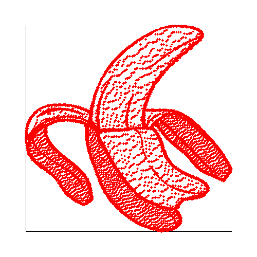

# Scatter Plot Generator in PHP

This project is a simple PHP application that reads a CSV file containing x, y coordinates, generates a scatter plot using the GD library, and saves the resulting plot as a PNG file.



## Project Structure

- **data.csv**  
  Contains the CSV data in the following format:
  ```csv
  x,y
  147,-519
  147,-525
  147,-533
  148,-507
  148,-511
  148,-515
  148,-529
  148,-537
  148,-541
  148,-545
  148,-549
  148,-554
  149,-499
  149,-503
  ```

- **plot.php**  
  The PHP script that:
  - Reads the CSV file.
  - Generates a scatter plot using the GD library.
  - Saves the plot as a PNG file (`plot.png`).

- **README.md**  
  This file, which explains the project, its structure, and how to set it up.

## Prerequisites

- **PHP** (Version 7.x or later recommended)
- **GD Library** enabled in PHP

### Enabling the GD Library in XAMPP

1. **Locate the `php.ini` file:**
   - Typically found at `D:\xampp8\php\php.ini`.

2. **Enable the GD extension:**
   - Open `php.ini` in a text editor.
   - Find the following line:
     ```ini
     ;extension=gd
     ```
   - Remove the semicolon (`;`) to uncomment it:
     ```ini
     extension=gd
     ```

3. **Restart Apache:**
   - Open the XAMPP Control Panel.
   - Stop and start Apache to apply the changes.

4. **Verify GD Installation:**
   - Create a file (e.g., `info.php`) with the following content:
     ```php
     <?php
     phpinfo();
     ?>
     ```
   - Open this file in your browser (`http://localhost/info.php`) and search for "GD" in the output.

## How to Run the Project

1. **Place Files:**
   - Ensure `data.csv` and `plot.php` are in the same directory (for example, in `D:\xampp8\htdocs\test\`).

2. **Start a PHP Server:**
   - You can run the PHP built-in server from the command line:
     ```bash
     php -S localhost:8000
     ```
   - Alternatively, use XAMPP to run Apache.

3. **Access the Script:**
   - Open your browser and navigate to:
     ```
     http://localhost:8000/plot.php
     ```
   - The script will process the CSV data, generate a scatter plot, and save it as `plot.png` in the same directory.
   - A success message will be displayed in the browser once the plot is saved.

## CSV Data Format

The CSV file should start with a header row and then the data rows, for example:

```csv
x,y
147,-519
147,-525
...
```

## License

This project is released under the [MIT License](LICENSE).
